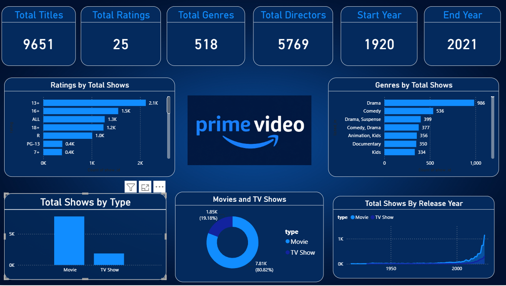

#  Amazon Prime Video Dashboard

An interactive Power BI dashboard built using the Amazon Prime Video dataset to analyze content distribution, genres, ratings, release years, and directors.

##  Dashboard Preview



---

##  Features

-  Total Titles
-  Total Ratings
-  Total Genres
-  Total Directors
-  Start Year & End Year
-  Ratings by Total Shows
-  Genres by Total Shows
-  Movies vs TV Shows
-  Release Year Trend
-  Country-wise Distribution

---

##  Tools Used

- Microsoft Power BI
- Power Query
- DAX
- Microsoft Excel

---

##  Dataset

- Amazon Prime Titles Dataset (.xlsx)

---

##  Repository Structure

```
Amazon-Prime-Video-Dashboard
│
├── Amazon_Prime_Dashboard_.png
├── amazon_prime_titles.xlsx
├── MINI_PROJECT_01_AMAZON_PRIME_ANALYSIS_REPORT_1.pdf
├── BG.jpg
├── logo.png
└── README.md
```

---

## 📷 Dashboard

This dashboard provides interactive insights into Amazon Prime Video content using professional visualizations and KPI cards.

---

##  Author

**Shivansh Dubey**

- B.Tech (Electronics & Computer Science)
- Bhilai Institute of Technology, Durg

---

⭐ If you like this project, don't forget to star this repository.
